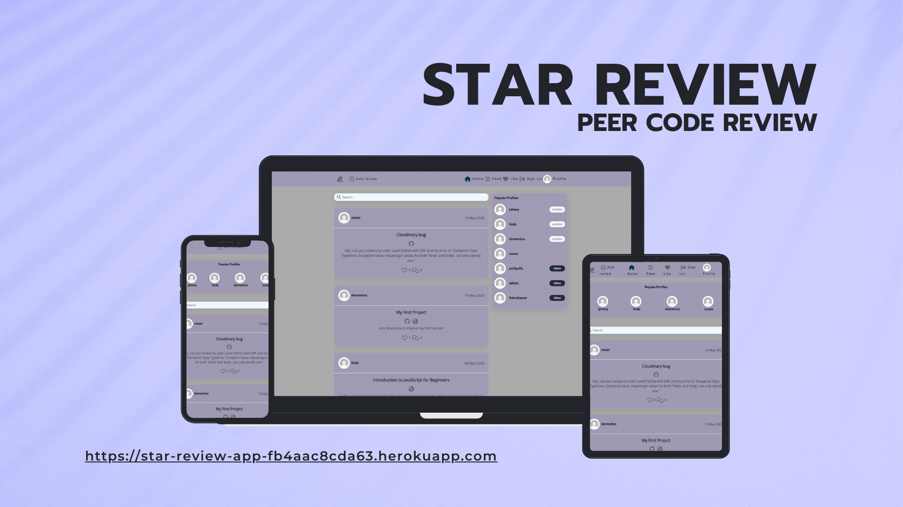
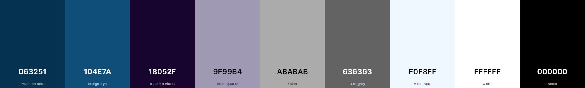

# [STAR REVIEW](https://star-review-app-fb4aac8cda63.herokuapp.com)

[](https://github.com/JohnnySonTrinh/review-app/commits/main)
[](https://github.com/JohnnySonTrinh/review-app/commits/main)
[](https://github.com/JohnnySonTrinh/review-app)

**Star Review** is the ultimate platform for developers to collaborate, review, and enhance code quality through seamless peer feedback. Whether you're a beginner seeking guidance or an experienced coder looking to refine your skills, Star Review offers the tools you need to excel.



## UX

The design of **Star Review** was planned to create an intuitive, engaging, and seamless experience for our users.

### Colour Scheme

- `#000000` used for primary text.
- `#063251` used for primary highlights.
- `#ababab` used for secondary text.
- `#104e7a` used for secondary highlights.

I used [coolors.co](https://coolors.co/063251-104e7a-18052f-9f99b4-ababab-636363-f0f8ff-ffffff-000000) to generate my colour palette.



I've used CSS `:root` variables to easily update the global colour scheme by changing only one value, instead of everywhere in the CSS file.

```css
:root {
	/* Primary color shades */
	--clr-primary-1: rgb(6, 50, 81);
	--clr-primary-2: rgb(16, 78, 122);
	/* Secondary color shades */
	--clr-secondary: rgb(24, 5, 47);
	--clr-secondary-2: rgb(159, 153, 180);
	--clr-grey-1: rgb(171, 171, 171);
	--clr-grey-2: rgb(99, 99, 99);
	--clr-grey-3: rgb(240, 248, 255);
	/* Warning color */
	--clr-warning: rgb(250, 66, 66);
	--clr-warning-light: rgb(255, 195, 84);
	/* White/black color shades */
	--clr-white: #ffffff;
	--clr-black: #000000;
	/* Primary and secondary font families */
	--ff-primary: "Roboto", sans-serif;
	--ff-secondary: "Open Sans", sans-serif;
	/* Commonly used CSS properties for consistency */
	--transition: color ease-in-out 0.3s;
	--spacing: 0.15rem;
	--light-shadow: 0 5px 15px rgba(0, 0, 0, 0.1);
	/* Glass morphism effect */
	--glass-background: rgba(76, 29, 248, 0.116);
	--glass-border: 1px solid rgba(255, 255, 255, 0.16);
	--glass-box-shadow: 0 4px 30px 0 rgba(0, 0, 0, 0.1);
	--glass-border-radius: 16px;
	--glass-blur: blur(4px);
}
```

### Typography

- [Roboto](https://fonts.google.com/specimen/Roboto) was used for the primary headers and titles.

- [Open Sans](https://fonts.google.com/specimen/Open+Sans?query=open+sans) was used for all other secondary text.

- [Font Awesome](https://fontawesome.com) icons were used throughout the site, such as the social media icons in the footer.

## User Stories

### New Site Users

- As a new site user, I would like to easily sign up for an account, so that I can start ask for a code review.
- As a new site user, I would like to browse different reviews without signing up.
- As a new site user, I would like to search for code review, so that I can find review that match my skill.
- As a new site user, I would like to create profile.

### Returning Site Users

- As a returning site user, I would like to see new posts in my feed, so that I can stay up to date with discussions that i "liked".
- As a returning site user, I would like to be able to edit reviews and comments that I created, so that I can easily change the content.
