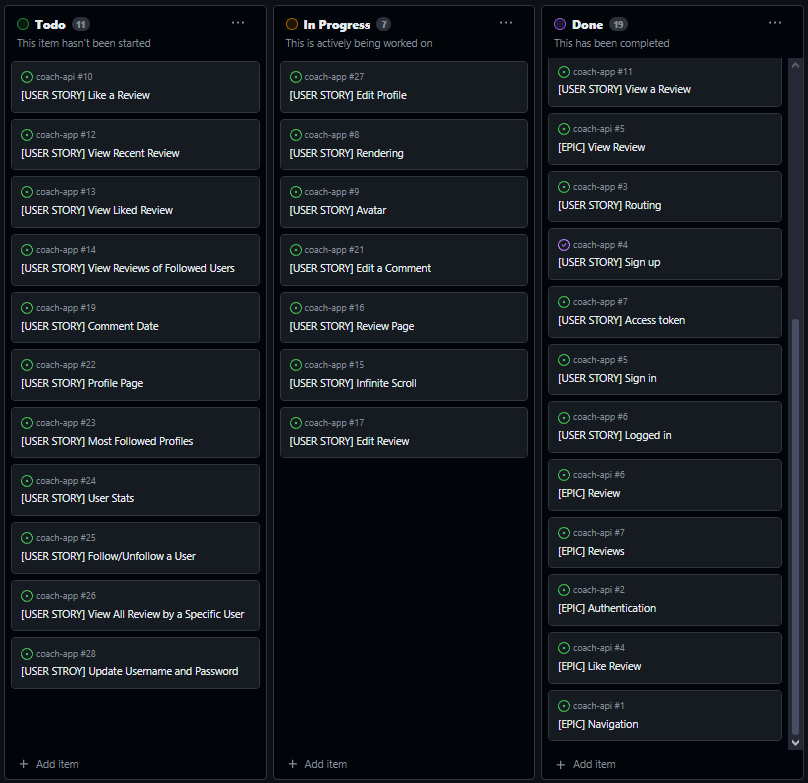

# [STAR REVIEW](https://star-review-app-fb4aac8cda63.herokuapp.com)

[](https://github.com/JohnnySonTrinh/review-app/commits/main)
[](https://github.com/JohnnySonTrinh/review-app/commits/main)
[](https://github.com/JohnnySonTrinh/review-app)

**Star Review** is the ultimate platform for developers to collaborate, review, and enhance code quality through seamless peer feedback. Whether you're a beginner seeking guidance or an experienced coder looking to refine your skills, Star Review offers the tools you need to excel.


## UX

The design of **Star Review** was planned to create an intuitive, engaging, and seamless experience for our users.

### Colour Scheme

- `#000000` used for primary text.
- `#063251` used for primary highlights.
- `#ababab` used for secondary text.
- `#104e7a` used for secondary highlights.

I used [coolors.co](https://coolors.co/063251-104e7a-18052f-9f99b4-ababab-636363-f0f8ff-ffffff-000000) to generate my colour palette.


I've used CSS `:root` variables to easily update the global colour scheme by changing only one value, instead of everywhere in the CSS file.

```css
:root {
	/* Primary color shades */
	--clr-primary-1: rgb(6, 50, 81);
	--clr-primary-2: rgb(16, 78, 122);
	/* Secondary color shades */
	--clr-secondary: rgb(24, 5, 47);
	--clr-secondary-2: rgb(159, 153, 180);
	--clr-grey-1: rgb(171, 171, 171);
	--clr-grey-2: rgb(99, 99, 99);
	--clr-grey-3: rgb(240, 248, 255);
	/* Warning color */
	--clr-warning: rgb(250, 66, 66);
	--clr-warning-light: rgb(255, 195, 84);
	/* White/black color shades */
	--clr-white: #ffffff;
	--clr-black: #000000;
	/* Primary and secondary font families */
	--ff-primary: "Roboto", sans-serif;
	--ff-secondary: "Open Sans", sans-serif;
	/* Commonly used CSS properties for consistency */
	--transition: color ease-in-out 0.3s;
	--spacing: 0.15rem;
	--light-shadow: 0 5px 15px rgba(0, 0, 0, 0.1);
	/* Glass morphism effect */
	--glass-background: rgba(76, 29, 248, 0.116);
	--glass-border: 1px solid rgba(255, 255, 255, 0.16);
	--glass-box-shadow: 0 4px 30px 0 rgba(0, 0, 0, 0.1);
	--glass-border-radius: 16px;
	--glass-blur: blur(4px);
}
```

### Typography

- [Roboto](https://fonts.google.com/specimen/Roboto) was used for the primary headers and titles.

- [Open Sans](https://fonts.google.com/specimen/Open+Sans?query=open+sans) was used for all other secondary text.

- [Font Awesome](https://fontawesome.com) icons were used throughout the site, such as the social media icons in the footer.

## User Stories

### New Site Users

- As a new site user, I would like to easily sign up for an account, so that I can start ask for a code review.
- As a new site user, I would like to browse different reviews without signing up.
- As a new site user, I would like to search for code review, so that I can find review that match my skill.
- As a new site user, I would like to create profile.

### Returning Site Users

- As a returning site user, I would like to see new posts in my feed, so that I can stay up to date with discussions that I "liked".
- As a returning site user, I would like to be able to edit reviews and comments that I created, so that I can easily change the content.

## Tools & Technologies Used

- [](https://tim.2bn.dev/markdown-builder) used to generate README and TESTING templates.
- [](https://git-scm.com) used for version control. (`git add`, `git commit`, `git push`)
- [](https://github.com) used for secure online code storage.
- [](https://gitpod.io) used as a cloud-based IDE for development.
- [](https://en.wikipedia.org/wiki/HTML) used for the main site content.
- [](https://en.wikipedia.org/wiki/CSS) used for the main site design and layout.
- [](https://www.javascript.com) used for user interaction on the site.
- [](https://www.heroku.com) used for hosting the deployed back-end site.
- [](https://getbootstrap.com) used as the front-end CSS framework for modern responsiveness and pre-built components.
- [](https://jestjs.io) used for automated JavaScript testing.
- [](https://www.postgresql.org) used as the relational database management.
- [](https://cloudinary.com) used for online static file storage.
- [](https://balsamiq.com/wireframes) used for creating wireframes.
- [](https://www.canva.com/p/canvawireframes) used for creating wireframes.
- [](https://fontawesome.com) used for the icons.
- [](https://chat.openai.com) used to help debug, troubleshoot, and explain things.

## Agile Development Process

### GitHub Projects

[GitHub Projects](https://github.com/JohnnySonTrinh/review-app/projects) served as an Agile tool for this project.
It isn't a specialized tool, but with the right tags and project creation/issue assignments, it can be made to work.

Through it, user stories, issues, and milestone tasks were planned, then tracked on a weekly basis using the basic Kanban board.



### GitHub Issues

[GitHub Issues](https://github.com/JohnnySonTrinh/coach-app/issues) served as an another Agile tool.
There, I used my own **User Story Template** to manage user stories.

It also helped with milestone iterations on a weekly basis.

- [Open Issues](https://github.com/JohnnySonTrinh/coach-app/issues) [](https://github.com/JohnnySonTrinh/coach-app/issues)

  

- [Closed Issues](https://github.com/JohnnySonTrinh/coach-app/issues?q=is%3Aissue+is%3Aclosed) [](https://github.com/JohnnySonTrinh/coach-app/issues?q=is%3Aissue+is%3Aclosed)

  

### MoSCoW Prioritization

I've decomposed my Epics into stories prior to prioritizing and implementing them.
Using this approach, I was able to apply the MoSCow prioritization and labels to my user stories within the Issues tab.

- **Must Have**: guaranteed to be delivered (_max 60% of stories_)
- **Should Have**: adds significant value, but not vital (_the rest ~20% of stories_)
- **Could Have**: has small impact if left out (_20% of stories_)
- **Won't Have**: not a priority for this iteration

## Testing

> [!NOTE]  
> For all testing, please refer to the [TESTING.md](TESTING.md) file.

## Deployment

The live deployed application can be found deployed on [Heroku](https://star-review-app-fb4aac8cda63.herokuapp.com/).

### Heroku Postgres Database

This project used [Heroku Postgres Database](https://devcenter.heroku.com/articles/heroku-postgresql) for backend.

You can find detailed information how to connect Heroku Postgres in [review-api](https://github.com/JohnnySonTrinh/review-api/blob/main/README.md)

### Heroku Deployment

This project uses [Heroku](https://www.heroku.com), a platform as a service (PaaS) that enables developers to build, run, and operate applications entirely in the cloud.

Deployment steps are as follows, after account setup:

- Select **New** in the top-right corner of your Heroku Dashboard, and select **Create new app** from the dropdown menu.
- Your app name must be unique, and then choose a region closest to you (EU or USA), and finally, select **Create App**.

The **Procfile** can be created with the following command:

- `web: serve -s build`

For Heroku deployment, follow these steps to connect your own GitHub repository to the newly created app:

Either:

- Select **Automatic Deployment** from the Heroku app.

Or:

- In the Terminal/CLI, connect to Heroku using this command: `heroku login -i`
- Set the remote for Heroku: `heroku git:remote -a app_name` (replace _app_name_ with your app name)
- After performing the standard Git `add`, `commit`, and `push` to GitHub, you can now type:
  - `git push heroku main`

The project should now be connected and deployed to Heroku!

### Local Deployment

This project can be cloned or forked in order to make a local copy on your own system.

For either method, you will need to install dependencies found in package.json

- `npm install`.

#### Cloning

You can clone the repository by following these steps:

1. Go to the [GitHub repository](https://github.com/JohnnySonTrinh/review-app)
2. Locate the Code button above the list of files and click it
3. Select if you prefer to clone using HTTPS, SSH, or GitHub CLI and click the copy button to copy the URL to your clipboard
4. Open Git Bash or Terminal
5. Change the current working directory to the one where you want the cloned directory
6. In your IDE Terminal, type the following command to clone my repository:
   - `git clone https://github.com/JohnnySonTrinh/review-app.git`
7. Press Enter to create your local clone.

Alternatively, if using Gitpod, you can click below to create your own workspace using this repository.

[](https://gitpod.io/#https://github.com/JohnnySonTrinh/review-app)

Please note that in order to directly open the project in Gitpod, you need to have the browser extension installed.
A tutorial on how to do that can be found [here](https://www.gitpod.io/docs/configure/user-settings/browser-extension).

#### Forking

By forking the GitHub Repository, we make a copy of the original repository on our GitHub account to view and/or make changes without affecting the original owner's repository.
You can fork this repository by using the following steps:

1. Log in to GitHub and locate the [GitHub Repository](https://github.com/JohnnySonTrinh/review-app)
2. At the top of the Repository (not top of page) just above the "Settings" Button on the menu, locate the "Fork" Button.
3. Once clicked, you should now have a copy of the original repository in your own GitHub account!

#### Environment Variables

- **Local**: Environment variables might be set directly in me development environment or stored in a .env file that is not committed to version control for security reasons.
- **Deployment**: On Heroku, environment variables should be set through the platform's settings (Config Vars) to keep sensitive information like database URLs, secret keys, and third-party API keys secure.

#### Database

- **Local**: I use SQLite as your database for simplicity and ease of setup in a local development environment.
- **Deployment**: On Heroku, I use a more robust database like PostgreSQL. Heroku offers its own PostgreSQL service, which can be easily integrated into the project.

## Credits

This section acknowledges the sources and inspirations that contributed to the development of the Review project. Proper credit is given to the original creators and resources that played a imported role to in shaping this project.

**Code Inspiration**

Based on the Code Institute Advanced Frontend course material.
Django REST Framework and Moments walkthrough.

### Content

| Source                                                                      | Location        | Notes                               |
| --------------------------------------------------------------------------- | --------------- | ----------------------------------- |
| [Chris Beams](https://chris.beams.io/posts/git-commit)                      | version control | "How to Write a Git Commit Message" |
| [W3Schools](https://www.w3schools.com/howto/howto_js_topnav_responsive.asp) | entire site     | responsive HTML/CSS/JS navbar       |
| [Moments](https://www.youtube.com/@mediaupload2326)                         | entire site     | Frontend Walkthrough                |
| [Django docs](https://docs.djangoproject.com/en/5.0/)                       | entire site     | Django/python syntax                |
| [React Bootstrap v4.6](https://react-bootstrap-v4.netlify.app)              | React Compoents | Styling of the whole site           |
| [React Router v5](https://v5.reactrouter.com)                               | Router          | Route Config                        |
| [React v17](https://legacy.reactjs.org/docs/getting-started.html)           | React           | How to use legacy react             |

### Media

| Source                                                        | Location           | Type  | Notes                                    |
| ------------------------------------------------------------- | ------------------ | ----- | ---------------------------------------- |
| [Squoosh](https://squoosh.app/)                               | entire site        | image | tool for image compression               |
| [Canva](https://www.canva.com/)                               | entire site        | image | tool for edit images                     |
| [Lucid Software](https://www.youtube.com/watch?v=xsg9BDiwiJE) | Database           | ERD   | tutorial for lucichart and ERD           |
| [Markdown Builder](https://tim.2bn.dev/markdown-builder)      | README and TESTING | tool  | tool to help generate the Markdown files |

### Acknowledgements

- I would like to thank my Mentor, [Julia Konovalova](https://github.com/IuliiaKonovalova). Her expertise and insights have been crucial throughout the development of this project.
- I appreciate the resources and tutorials available for CI students that have helped me acquire new skills and knowledge essential for this project.
- Special thanks to my dog Loke aka LowKey for being my "rubber duck debugging" tool and stay with me throughout the long nights.
