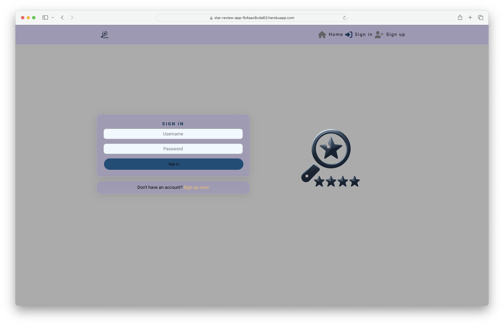

# Testing

> [!NOTE]  
> Return back to the [README.md](README.md) file.

Welcome to the Star Review testing results, in this file you will see how each and every element and features tested to ensure each features worked as intended.

## Code Validation

### HTML

I have used the recommended [HTML W3C Validator](https://validator.w3.org) to validate all of my HTML files.

| Directory | File       | Screenshot                                             | Notes            |
| --------- | ---------- | ------------------------------------------------------ | ---------------- |
| public    | index.html |  | Bad Value Errors |

### CSS

I have used the recommended [CSS Jigsaw Validator](https://jigsaw.w3.org/css-validator) to validate all of my CSS files.

| Directory | File                            | Screenshot                                                           | Notes                   |
| --------- | ------------------------------- | -------------------------------------------------------------------- | ----------------------- |
| src       | App.module.css                  |                   | No errors, Warnings(13) |
| src       | index.css                       |                 | No errors, Warnings(3)  |
| src       | Asset.module.css                |                 | No Error Found!         |
| src       | Avatar.module.css               |                | No Error Found!         |
| src       | Button.module.css               |                | No errors, Warnings(17) |
| src       | MoreDropdown.module.css         |          | No Error Found!         |
| src       | NavBar.module.css               |                | No errors, Warnings(4)  |
| src       | Note.module.css                 |                  | No errors, Warnings(2)  |
| src       | NoteCreateEditForm.module.css   |    | No errors, Warnings(6)  |
| src       | Profile.module.css              |               | No Error Found!         |
| src       | ProfilePage.module.css          |           | No Error Found!         |
| src       | Review.module.css               |                | No errors, Warnings(8)  |
| src       | ReviewCreateEditForm.module.css |  | No errors, Warnings(6)  |
| src       | ReviewsPage.module.css          |           | No errors, Warnings(8)  |
| src       | SignInUpForm.module.css         |          | No errors, Warnings(5)  |

### JavaScript

I have used the recommended [JShint Validator](https://jshint.com) to validate all of my JS files.

I used this command before pasting the code **/_ jshint esversion: 11, asi: true _/** for ES6 warnings.

| Directory          | File                     | Screenshot                                                               | Notes        |
| ------------------ | ------------------------ | ------------------------------------------------------------------------ | ------------ |
| src                | App.js                   |                    | Warnings(2)  |
| src/api            | axiosDefaults.js         |          | Pass         |
| src/components     | Asset.js                 |                  | Warnings(2)  |
| src/components     | Avatar.js                |                 | Warnings(2)  |
| src/components     | MoreDropdown.js          |           | Warnings(13) |
| src/components     | NavBar.js                |                 | Warnings(2)  |
| src/components     | NotFound.js              |               | Warnings(2)  |
| src/contexts       | CurrentUserContext.js    |     | Warnings(3)  |
| src/contexts       | ProfileDataContext.js    |     | Warnings(2)  |
| src/hooks          | useClickOutsideToggle.js |  | Pass         |
| src/hooks          | useRedirect.js           |            | Pass         |
| src                | index.js                 |                  | Warnings(4)  |
| src/page/auth      | SignInForm.js            |             | Warnings(2)  |
| src/page/auth      | SignUpForm.js            |             | Warnings(2)  |
| src/pages/notes    | Note.js                  |                   | Warnings(2)  |
| src/pages/notes    | NoteCreateForm.js        |         | Warnings(2)  |
| src/pages/notes    | NoteEditForm.js          |           | Warnings(3)  |
| src/pages/profiles | PopularProfiles.js       |        | Warnings(2)  |
| src/pages/profiles | Profile.js               |                | Warnings(2)  |
| src/pages/profiles | ProfileEditForm.js       |        | Warnings(2)  |
| src/pages/profiles | ProfilePage.js           |            | Warnings(2)  |
| src/pages/profiles | UsernameForm.js          |           | Warnings(2)  |
| src/pages/profiles | UserPasswordForm.js      |       | Warnings(2)  |
| src/pages/reviews  | Review.js                |                 | Warnings(4)  |
| src/pages/reviews  | ReviewCreateForm.js      |       | Warnings(2)  |
| src/pages/reviews  | ReviewEditForm.js        |         | Warnings(2)  |
| src/pages/reviews  | ReviewPage.js            |             | Warnings(2)  |
| src/pages/reviews  | ReviewsPage.js           |            | Warnings(2)  |
| src/utils          | utils.js                 |                  | Warnings(5)  |

## Browser Compatibility

I've tested my deployed project on multiple browsers to check for compatibility issues.

| Browser  | Home                                                   | Profile                                                   | Review                                                   | SignIn                                                   | Create Review                                                  | Notes               |
| -------- | ------------------------------------------------------ | --------------------------------------------------------- | -------------------------------------------------------- | -------------------------------------------------------- | -------------------------------------------------------------- | ------------------- |
| Chrome   |   |   |   |   |   | Works as expected   |
| FireFox  |  |  |  |  |  | Works as expected   |
| Opera GX |  |  |  |  |  | Works as expected   |
| Edge     |     |     |     |     |     | Works as expected   |
| Safari   |   |   |   |   |   | No access to tokens |

## Responsiveness

I've tested my deployed project on multiple devices to check for responsiveness issues.

| Device                | Home                                                         | Profile                                                         | Review                                                         | SignIn                                                         | Create Review                                                        | Notes               |
| --------------------- | ------------------------------------------------------------ | --------------------------------------------------------------- | -------------------------------------------------------------- | -------------------------------------------------------------- | -------------------------------------------------------------------- | ------------------- |
| Mobile (DevTools)     |   |   |   |   |   | Works as expected   |
| Tablet (DevTools)     |   |   |   |   |   | Works as expected   |
| 4K Monitor (DevTools) |       |       |       |       |       | Works as expected   |
| Desktop (PC/Windows)  |  |  |  |  |  | Works as expected   |
| Laptop (MacOS)        |      |      |      |      |      | Works as expected   |
| iPhone                |   |   |   |   |   | No access to tokens |

## Lighthouse Audit

I've tested my deployed project using the Lighthouse Audit tool to check for any major issues.

| Page         | Mobile                                                      | Desktop                                                      | Notes                                                                      |
| ------------ | ----------------------------------------------------------- | ------------------------------------------------------------ | -------------------------------------------------------------------------- |
| Home         |      |      | Largest Contentful Paint elements                                          |
| Sign In      |    |    | Some minor warnings                                                        |
| Profile      |   |   | Largest Contentful Paint element                                           |
| Edit Profile |  |  | Issues were logged in the Issues panel in Chrome Devtools, 8 cookies found |
| Review       |    |    | Largest Contentful Paint elements                                          |

## Defensive Programming

### Manual Testing

This web app was tested in Chrome Developer Tools for troubleshooting functionality and style problems during development. It was tested on iOS with Chrome and Safari.

| Action                               | Expectation                                                                                                                                                 | Pass | Details                                                                                |
| :----------------------------------- | :---------------------------------------------------------------------------------------------------------------------------------------------------------- | :--: | :------------------------------------------------------------------------------------- |
| Navbar                               |                                                                                                                                                             |      |                                                                                        |
| **Logo link**                        | Direct to home page                                                                                                                                         |  ✅  |                                                                                        |
| **Home link**                        | Direct to home page                                                                                                                                         |  ✅  |                                                                                        |
| **Add Review link (not logged in)**  | Redirect to sign in page                                                                                                                                    |  ✅  |                                                                                        |
| **Add Review link (logged in)**      | Direct to review create form                                                                                                                                |  ✅  |                                                                                        |
| **Feed link (for logged-in users)**  | Direct to page with reviews from followed users                                                                                                             |  ✅  |                                                                                        |
| **Like link (for logged-in users)**  | Direct to page with like reviews                                                                                                                            |  ✅  |                                                                                        |
| **Sign in link**                     | Direct to sign in form                                                                                                                                      |  ✅  |                                                                                        |
| **Sign up link**                     | Direct to sign up form                                                                                                                                      |  ✅  |                                                                                        |
| **Sign out link**                    | Log out user                                                                                                                                                |  ✅  | In the future this will have a confirmation page and success message                   |
| **Profile link**                     | Direct to user's profile                                                                                                                                    |  ✅  |                                                                                        |
| Sign up page                         |                                                                                                                                                             |      |                                                                                        |
| **Text fields**                      | User is able to type a username, password, and password confirmation                                                                                        |  ✅  |                                                                                        |
| **Sign up button (incorrect entry)** | Show appropriate error message(s) so that user can successfully create an account (_"This field may not be blank"_ etc)                                     |  ✅  |                                                                                        |
| **Sign up button**                   | Sign in user and redirect to home page                                                                                                                      |  ✅  | In the future there will be a success message                                          |
| **Sign in link**                     | Direct to sign in form                                                                                                                                      |  ✅  |                                                                                        |
| Sign in page                         |                                                                                                                                                             |      |                                                                                        |
| **Text fields**                      | User is able to type their username and password                                                                                                            |  ✅  |                                                                                        |
| **Sign in button (incorrect entry)** | Show appropriate error message(s) so that user can successfully sign in (_"Unable to log in with provided credentials"_ etc)                                |  ✅  |                                                                                        |
| **Sign in button**                   | Sign in user and redirect to home page                                                                                                                      |  ✅  | In the future there will be a success message                                          |
| **Sign up link**                     | Direct to sign up form                                                                                                                                      |  ✅  |                                                                                        |
| Home page                            |                                                                                                                                                             |      |                                                                                        |
| **Search bar**                       | User can enter text, results load automatically after 3 seconds                                                                                             |  ✅  |                                                                                        |
| **Search bar (no results)**          | User sees "no results" message and image                                                                                                                    |  ✅  |                                                                                        |
| **Popular Profiles**                 | Users' avatars and usernames are visible, with the most-followed users first                                                                                |  ✅  |                                                                                        |
| **Popular Profiles - follow**        | User can click Follow button and reviews from that user will appear in Feed                                                                                 |  ✅  |                                                                                        |
| **Popular Profiles - unfollow**      | User can click Unfollow button and reviews from that user will no longer appear in Feed                                                                     |  ✅  | If there are no followed users, the Feed page shows the "no results" message and image |
| **Review**                           | Review are visible, most recent first, with note and like count                                                                                             |  ✅  | Infinite scroll is working in the future infinite scroll will be more useful           |
| **Search bar**                       | User can enter text, results load automatically after 3 seconds                                                                                             |  ✅  |                                                                                        |
| **Search bar (no results)**          | User sees "no results" message and image                                                                                                                    |  ✅  |                                                                                        |
| **Comments**                         | User sees notes below the plan, most recent first                                                                                                           |  ✅  |                                                                                        |
| **Create note**                      | User can type in the box and click Review to add a note                                                                                                     |  ✅  |                                                                                        |
| **Edit/delete note**                 | Clicking the three dots menu gives the user an option to edit or delete their note                                                                          |  ✅  |                                                                                        |
| Feed (Reviews page)                  |                                                                                                                                                             |      |                                                                                        |
| **Reviews**                          | Reviews from followed users are visible, most recent first, with note and like count                                                                        |  ✅  |                                                                                        |
| **Unfollow**                         | When the user unfollows another user, reviews from that user no longer appears on this page after refresh                                                   |  ✅  |                                                                                        |
| **Review**                           | User can click on a review to open the review detail                                                                                                        |  ✅  |                                                                                        |
| **Review detail**                    | User sees the review with the avatar and username of the user who reviewed, the date it was reviewed, any notes, like and note count, and a note input form |  ✅  |                                                                                        |
| **Comments**                         | User sees notes below the review, most recent first                                                                                                         |  ✅  |                                                                                        |
| **Create note**                      | User can type in the box and click Review to add a note                                                                                                     |  ✅  |                                                                                        |
| **Edit/delete note**                 | Clicking the three dots menu gives the user an option to edit or delete their note                                                                          |  ✅  |                                                                                        |
| Liked                                |                                                                                                                                                             |      |                                                                                        |
| **Reviews**                          | Reviews liked by the user are visible, most recent first, with note and like count                                                                          |  ✅  |                                                                                        |
| **Unlike**                           | When the user clicks the heart again, the review no longer appears on this page after refresh                                                               |  ✅  |                                                                                        |
| **Review**                           | User can click on a review to open the review detail                                                                                                        |  ✅  |                                                                                        |
| **Review detail**                    | User sees the review with the avatar and username of the user who reviewed, the date it was reviewed, any notes, like and note count, and a note input form |  ✅  |                                                                                        |
| **Comments**                         | User sees notes below the review, most recent first                                                                                                         |  ✅  |                                                                                        |
| **Create note**                      | User can type in the box and click Review to add a note                                                                                                     |  ✅  |                                                                                        |
| **Edit/delete note**                 | Clicking the three dots menu gives the user an option to edit or delete their note                                                                          |  ✅  |                                                                                        |
| About                                |                                                                                                                                                             |      |                                                                                        |
| **About info**                       | Text is visible                                                                                                                                             |  ✅  |                                                                                        |
| User's Profile                       |                                                                                                                                                             |      |                                                                                        |
| **Profile page**                     | Username, bio, and review/followers/following counts are visible, reviews are visible                                                                       |  ✅  |                                                                                        |
| **Profile page (no reviews)**        | "No results" message is visible                                                                                                                             |  ✅  |                                                                                        |
| **Edit profile**                     | Clicking the three dots menu gives the user an option to edit, change username, or change password                                                          |  ✅  |                                                                                        |
| **Edit profile - details**           |                                                                                                                                                             |  ✅  |                                                                                        |
| **Upload image**                     |                                                                                                                                                             |  ✅  |                                                                                        |
| **Cancel button**                    |                                                                                                                                                             |  ✅  |                                                                                        |
| **Save button**                      |                                                                                                                                                             |  ✅  |                                                                                        |
| **Change username**                  |                                                                                                                                                             |  ✅  |                                                                                        |
| **Change password**                  |                                                                                                                                                             |  ✅  |                                                                                        |

## User Story Testing

All [user stories](#user-stories) have been tracked, implemented, and tested for full functionality.

| User Story                                                                                                                                                                       | Pass | Details                                                                                                                                                      |
| :------------------------------------------------------------------------------------------------------------------------------------------------------------------------------- | :--: | :----------------------------------------------------------------------------------------------------------------------------------------------------------- |
| Navigation & Authentication                                                                                                                                                      |      |                                                                                                                                                              |
| **Navigation**: As a user I can view a navbar from every page so that I can navigate easily between pages                                                                        |  ✅  | The navbar is visible on all pages                                                                                                                           |
| **Routing**: As a user I can navigate through pages quickly so that I can view content seamlessly without page refresh                                                           |  ✅  | Pages are easily reachable using the navbar or other clickable links throughout the app                                                                      |
| **Authentication - Sign up**: As a user I can create a new account so that I can access all the features for signed up users                                                     |  ✅  | The sign up option in the navbar brings users to a registration form                                                                                         |
| **Authentication - Sign in**: As a user I can sign in to the app so that I can access functionality for logged in users                                                          |  ✅  | The sign in option in the navbar brings users to a sign in form                                                                                              |
| **Authentication - Logged in status**: As a user I can tell if I am logged in or not so that I can log in if I need to                                                           |  ✅  | When a user is logged out, they see the option to log in. When a user is logged in, their avatar appears in the navbar and they have the option to sign out. |
| **Authentication - Refreshing access tokens**: As a user I can maintain my logged-in status until I choose to log out so that my user experience is not compromised              |  ✅  | A logged in user stays logged in                                                                                                                             |
| **Navigation: Conditional rendering**: As a logged out user I can see sign in and sign up options so that I can sign in/sign up                                                  |  ✅  | Sign in and sign up options are visible in the navbar                                                                                                        |
| **Avatar**: As a user I can view users' avatars so that I can easily identify users of the application                                                                           |  ✅  | User avatars appear in on reviews, comments, etc.                                                                                                            |
| Adding & Liking Reviews                                                                                                                                                          |      |                                                                                                                                                              |
| **Create reviews**: As a logged in user I can create reviews so that I can share my images with the world!                                                                       |  ✅  | The New review option brings the user to a create review form                                                                                                |
| **View a review**: As a user I can view the details of a single review so that I can learn more about it                                                                         |  ✅  | A user can click on a review to view it                                                                                                                      |
| **Like a review**: As a logged in user I can like a review so that I can show my support for the reviews that interest me                                                        |  ✅  | A user can like a review by clicking on the heart icon                                                                                                       |
| The Reviews Page                                                                                                                                                                 |      |                                                                                                                                                              |
| **View most recent reviews**: As a user I can view all the most recent reviews, ordered by most recently created first so that I am up to date with the newest content           |  ✅  | The reviews page contains all reviews, ordered by date wiht he most recent reviews first                                                                     |
| **Keyword search**: As a user, I can search for reviews with keywords, so that I can find the reviews and user profiles I am most interested in                                  |  ✅  | The keyword search returns reviews containing the entered keyword                                                                                            |
| **View liked reviews**: As a logged in user I can view the reviews I liked so that I can find the reviews I enjoy the most                                                       |  ✅  | A user can click on Liked in the navbar to view all the reviews they have liked                                                                              |
| **View reviews of followed users**: As a logged in user I can view content filtered by users I follow so that I can keep up to date with what they are reviewing about           |  ✅  | A user can click on Feed in the navbar to view reviews by all the users they have followed                                                                   |
| **Infinite scroll**: As a user I can keep scrolling through the images on the site, that are loaded for me automatically so that I don't have to click on "next page" etc        |  ✅  | _Note: Page size is set to 50 as a bug fix for Locations, and infinite scroll will become more useful when this is reset to 10_                              |
| The Review Page                                                                                                                                                                  |      |                                                                                                                                                              |
| **Review page**: As a user I can view the review page so that I can read the comments about the review                                                                           |  ✅  | A user can click on the review to open it and see the comments                                                                                               |
| **Edit review**: As a review owner I can edit my review title and description so that I can make corrections or update my review after it was created                            |  ✅  | A user can edit their review by clicking the three dots menu, which brings them to the review edit form                                                      |
| **Create a comment**: As a logged in user I can add comments to a review so that I can share my thoughts about the review                                                        |  ✅  | A user can add comments below the review using the comment input box                                                                                         |
| **Comment date**: As a user I can see how long ago a comment was made so that I know how old a comment is                                                                        |  ✅  | Comments have time stamps                                                                                                                                    |
| **View comments**: As a user I can read comments on reviews so that I can read what other users think about the reviews                                                          |  ✅  | Comments are visible below reviews                                                                                                                           |
| **Delete comments**: As an owner of a comment I can delete my comment so that I can control removal of my comment from the application                                           |  ✅  | A user can delete their comment by clicking the three dots menu which will give them an option to delete                                                     |
| **Edit a comment**: As an owner of a comment I can edit my comment so that I can fix or update my existing comment                                                               |  ✅  | A user can edit their comment by clicking the three dots menu which will give them an option to edit                                                         |
| The Profile Page                                                                                                                                                                 |      |                                                                                                                                                              |
| **Profile page**: As a user I can view other users' profiles so that I can see their reviews and learn more about them                                                           |  ✅  | A user can click on the other users' avatars to see their profile pages                                                                                      |
| **Most followed profiles**: As a user I can see a list of the most followed profiles so that I can see which profiles are popular                                                |  ✅  | The most-followed users appear as Worldviews trailblazers                                                                                                    |
| **User profile - User stats**: As a user I can view statistics about a specific user: bio, number of reviews, follows and users followed so that I can learn more about them     |  ✅  | These statistics are visible on each user's profile page                                                                                                     |
| **Follow/Unfollow a user**: As a logged in user I can follow and unfollow other users so that I can see and remove reviews by specific users in my reviews feed                  |  ✅  | A user can click the Follow and Unfollow buttons to follor or unfollow another user                                                                          |
| **View all reviews by a specific user**: As a user I can view all the reviews by a specific user so that I can catch up on their latest reviews, or decide I want to follow them |  ✅  | All reviews by a specific user appear on their profile page                                                                                                  |
| **Edit profile**: As a logged in user I can edit my profile so that I can change my profile picture and bio                                                                      |  ✅  | A user can navigate to their profile page and click the three dots menu to edit their profile                                                                |
| **Update username and password**: As a logged in user I can update my username and password so that I can change my display name and keep my profile secure                      |  ✅  | A user can update their username and password from the three dots menu on their Profile page                                                                 |

## Bugs

- Dropdownbar position was the left instead of right.[screenshot](documentation/bugs/bug-1.png)

  - I tried to move the Dropdown component after the username, but it did not work.
  - Typo in MoreDropdown.module.css "right: 10;"
  - Fix: right: 10px;

- All comments(notes) appeared in every review even if FK was not the same. [screenshot](documentation/bugs/bug-2.png)

  - Asked Chatgpt and searched on Stackoverflow for help.
  - In the moments tutorial I notice that I need a extra layor/filter to filter the notes
  - const filteredNotes = notes.results.filter((note) => note.review === parseInt(id));

- Page not loading
  - The error was `TypeError: Cannot read properties of undefined (reading 'length') at PopularProfiles.js:17:32`
  - It could be a problem with how the page is rendering
  - All of the code is the same as in the walkthrough and I have not changed anything recently, but other students have had this issue before.
  - The solution was to add ? to make it return false instead of trying to keep loading

## Unfixed Bugs

- The "Change Avatar" bug remains unresolved, and it appears that the Cloudinary API or profile models are not functioning as intended. Additionally, I have mentioned that there have been multiple migration problems in the backend, Read more... [Review Backend bugs](https://github.com/JohnnySonTrinh/review-api/blob/main/TESTING.md)

- It has been brought to my attention that some issues have been encountered while browsing the application using various devices, including iPad, iPhone (Safari), VPN, and Mac (Safari). During testing, it was observed that the login process was unsuccessful, as the user was redirected to the login page repeatedly during Lighthouse test (incognito). It is suspected that there may be an issue with the JSON Web Token (JWT) system, which is preventing cookies or access tokens from being processed correctly.

- To diagnose the root cause of the issue, it is recommended that a more detailed analysis be conducted to determine whether the issue is related to the frontend or backend architecture of the application. A thorough investigation is required to resolve the issue and ensure the user experience is not compromised.

- The section on unfixed bugs remains largely unaddressed due to the project's deadline constraints. Efforts to resolve these issues will be prioritized following the completion of current assessments to ensure the application meets its operational goals and provides a seamless user experience.

> [!NOTE]  
> There are no remaining bugs that I am aware of.
