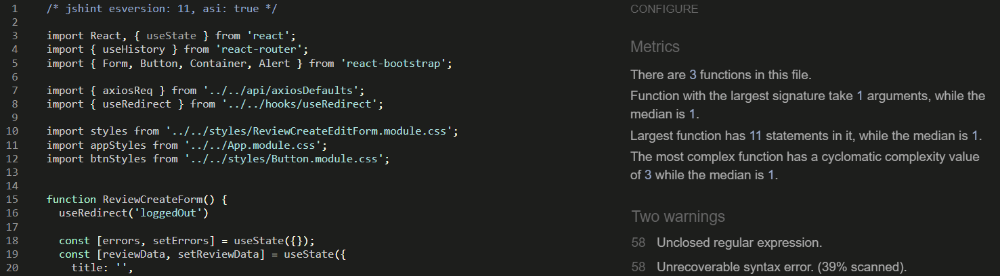

# Testing

> [!NOTE]  
> Return back to the [README.md](README.md) file.

Welcome to the Star Review testing results, in this file you will see how each and every element and features tested to ensure each features worked as intended.

## Code Validation

### HTML

I have used the recommended [HTML W3C Validator](https://validator.w3.org) to validate all of my HTML files.

| Directory | File       | Screenshot                                             | Notes            |
| --------- | ---------- | ------------------------------------------------------ | ---------------- |
| public    | index.html |  | Bad Value Errors |

### CSS

I have used the recommended [CSS Jigsaw Validator](https://jigsaw.w3.org/css-validator) to validate all of my CSS files.

| Directory | File                            | Screenshot                                                           | Notes                   |
| --------- | ------------------------------- | -------------------------------------------------------------------- | ----------------------- |
| src       | App.module.css                  |                   | No errors, Warnings(13) |
| src       | index.css                       |                 | No errors, Warnings(3)  |
| src       | Asset.module.css                |                 | No Error Found!         |
| src       | Avatar.module.css               |                | No Error Found!         |
| src       | Button.module.css               |                | No errors, Warnings(17) |
| src       | MoreDropdown.module.css         |          | No Error Found!         |
| src       | NavBar.module.css               |                | No errors, Warnings(4)  |
| src       | Note.module.css                 |                  | No errors, Warnings(2)  |
| src       | NoteCreateEditForm.module.css   |    | No errors, Warnings(6)  |
| src       | Profile.module.css              |               | No Error Found!         |
| src       | ProfilePage.module.css          |           | No Error Found!         |
| src       | Review.module.css               |                | No errors, Warnings(8)  |
| src       | ReviewCreateEditForm.module.css |  | No errors, Warnings(6)  |
| src       | ReviewsPage.module.css          |           | No errors, Warnings(8)  |
| src       | SignInUpForm.module.css         |          | No errors, Warnings(5)  |

### JavaScript

I have used the recommended [JShint Validator](https://jshint.com) to validate all of my JS files.

I used this command before pasting the code **/_ jshint esversion: 11, asi: true _/** for ES6 warnings.

| Directory          | File                     | Screenshot                                                               | Notes        |
| ------------------ | ------------------------ | ------------------------------------------------------------------------ | ------------ |
| src                | App.js                   |                    | Warnings(2)  |
| src/api            | axiosDefaults.js         |          | Pass         |
| src/components     | Asset.js                 |                  | Warnings(2)  |
| src/components     | Avatar.js                |                 | Warnings(2)  |
| src/components     | MoreDropdown.js          |           | Warnings(13) |
| src/components     | NavBar.js                |                 | Warnings(2)  |
| src/components     | NotFound.js              |               | Warnings(2)  |
| src/contexts       | CurrentUserContext.js    |     | Warnings(3)  |
| src/contexts       | ProfileDataContext.js    |     | Warnings(2)  |
| src/hooks          | useClickOutsideToggle.js |  | Pass         |
| src/hooks          | useRedirect.js           |            | Pass         |
| src                | index.js                 |                  | Warnings(4)  |
| src/page/auth      | SignInForm.js            |             | Warnings(2)  |
| src/page/auth      | SignUpForm.js            |             | Warnings(2)  |
| src/pages/notes    | Note.js                  |                   | Warnings(2)  |
| src/pages/notes    | NoteCreateForm.js        |         | Warnings(2)  |
| src/pages/notes    | NoteEditForm.js          |           | Warnings(3)  |
| src/pages/profiles | PopularProfiles.js       |        | Warnings(2)  |
| src/pages/profiles | Profile.js               |                | Warnings(2)  |
| src/pages/profiles | ProfileEditForm.js       |        | Warnings(2)  |
| src/pages/profiles | ProfilePage.js           |            | Warnings(2)  |
| src/pages/profiles | UsernameForm.js          |           | Warnings(2)  |
| src/pages/profiles | UserPasswordForm.js      |       | Warnings(2)  |
| src/pages/reviews  | Review.js                |                 | Warnings(4)  |
| src/pages/reviews  | ReviewCreateForm.js      |       | Warnings(2)  |
| src/pages/reviews  | ReviewEditForm.js        |         | Warnings(2)  |
| src/pages/reviews  | ReviewPage.js            |             | Warnings(2)  |
| src/pages/reviews  | ReviewsPage.js           |            | Warnings(2)  |
| src/utils          | utils.js                 |                  | Warnings(5)  |
